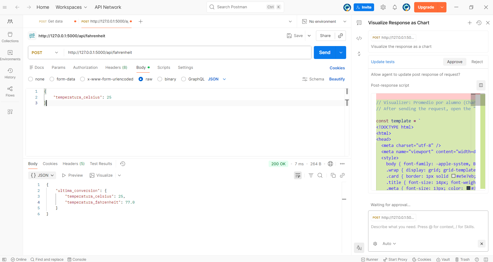
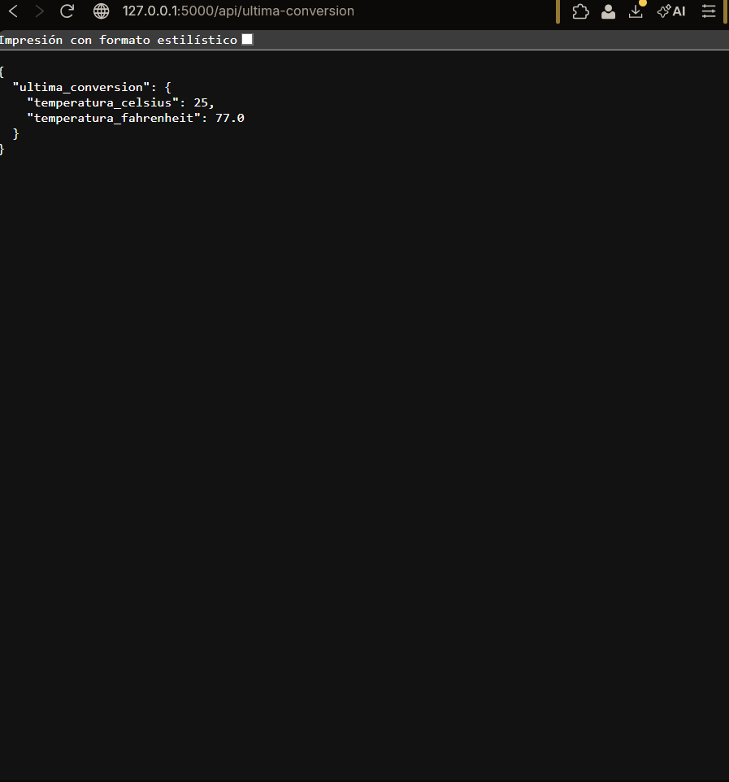
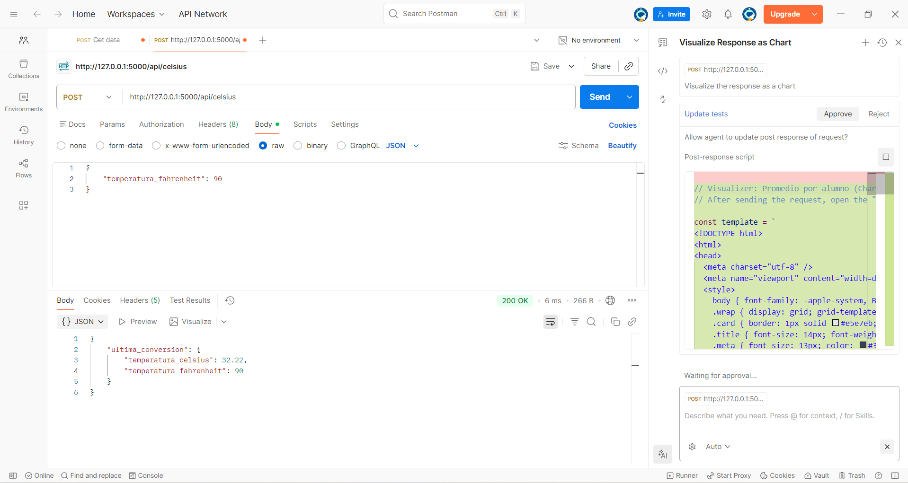
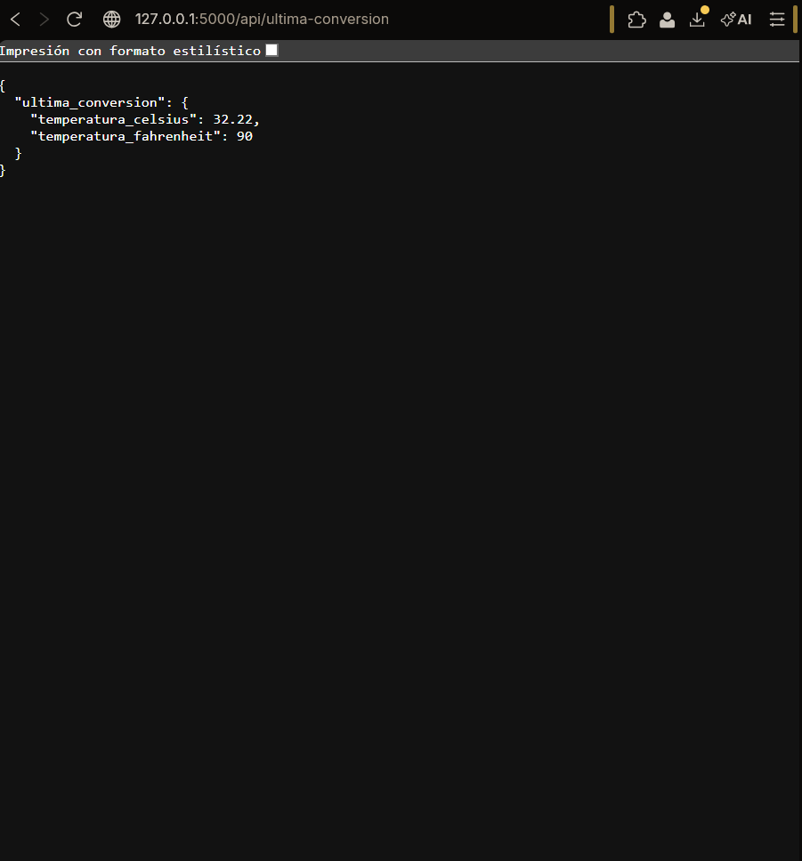

# API Conversor de Unidades de Temperatura

Esta API REST, desarrollada con **Python y Flask**, permite realizar conversiones entre grados Celsius y Fahrenheit. 
Es un proyecto práctico para la materia de **Desarrollo Web Orientado a Servicios**.

---

## Estructura del Proyecto

```text
api_conversor_unidades/
├── venv/                 # Entorno virtual
├── images/               # Capturas de pantalla (Evidencias)
│   ├── GET_C_TO_F.png
│   ├── GET_F_TO_C.png
│   ├── POST_C_TO_F.png
│   └── POST_F_TO_C.png
├── .gitignore            # Archivos excluidos de Git
├── app.py                # Lógica principal de la API
└── README.md             # Documentación
```

Explicación del Código (app.py)
El servidor utiliza tres rutas principales y una variable global para gestionar los datos:
Variable ultima_conversion: Funciona como una base de datos temporal en memoria para almacenar el resultado del último cálculo realizado.

1. Ruta /api/fahrenheit (POST):
Recibe un JSON con temperatura_celsius.
Aplica la fórmula:
$$ **(C \times 9/5) + 32** $$
Actualiza la variable global y retorna el resultado.
2. Ruta /api/celsius (POST):
Recibe un JSON con temperatura_fahrenheit.
Aplica la fórmula:
$$ **(F - 32) \times 5/9** $$
Actualiza la variable global y retorna el resultado.
3. Ruta /api/ultima-conversion (GET):
Permite consultar desde el navegador o Postman cuál fue el último cálculo procesado sin tener que enviar datos nuevamente.

##  Pruebas de Funcionamiento (Evidencias)
### Conversión a Fahrenheit
Petición POST:



Resultado en Navegador/GET:


### Conversión a Celsius
Petición POST:



Resultado en Navegador/GET:



## Cómo ejecutarlo
1. Clonar el repositorio.
2. Activar el entorno virtual: ```text .\venv\Scripts\activate ```.
3. Instalar Flask: ```text pip install flask ```.
4. Ejecutar: ```textpython app.py ```.
